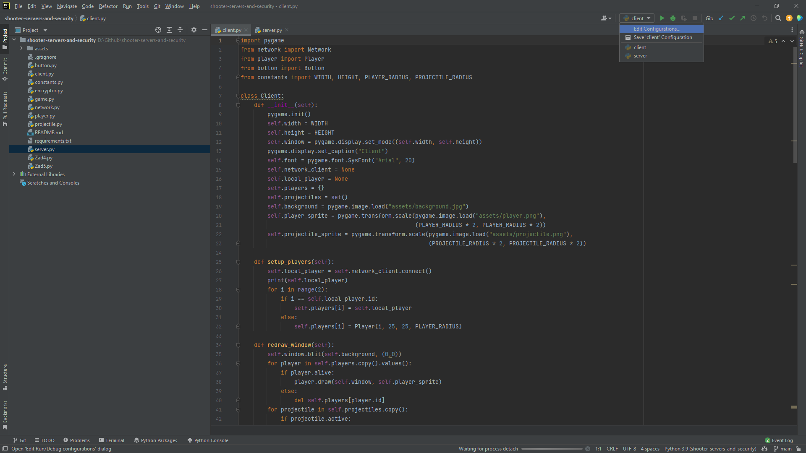
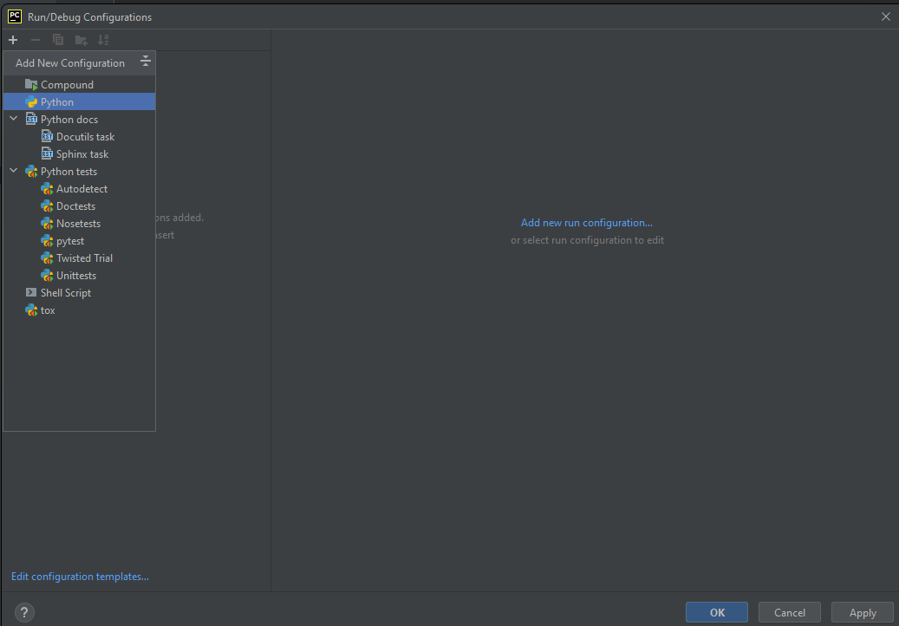
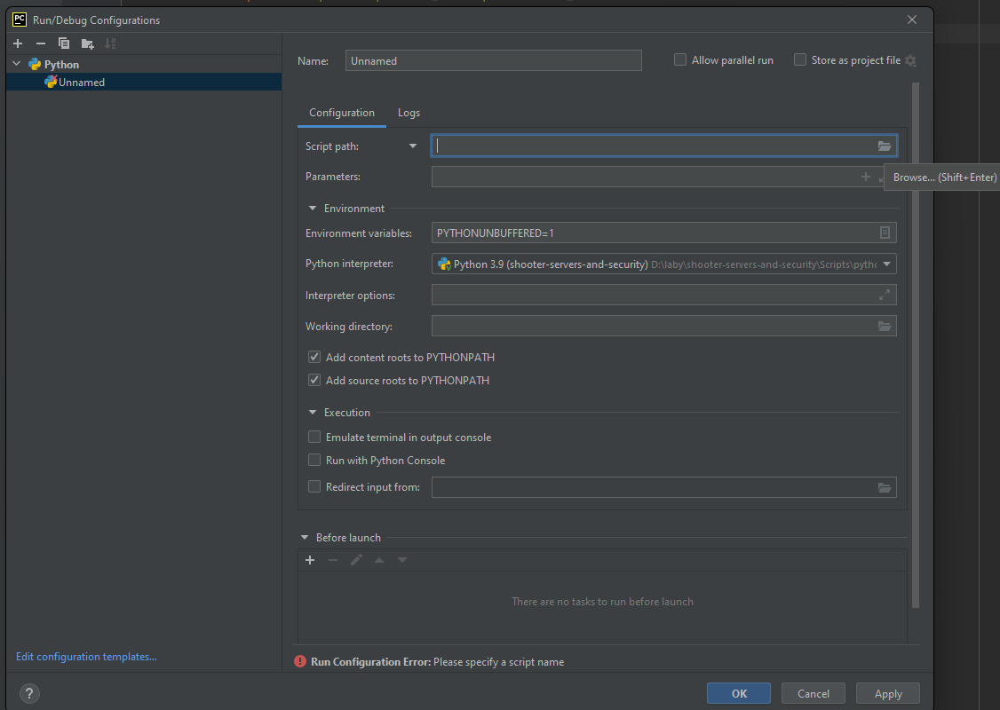
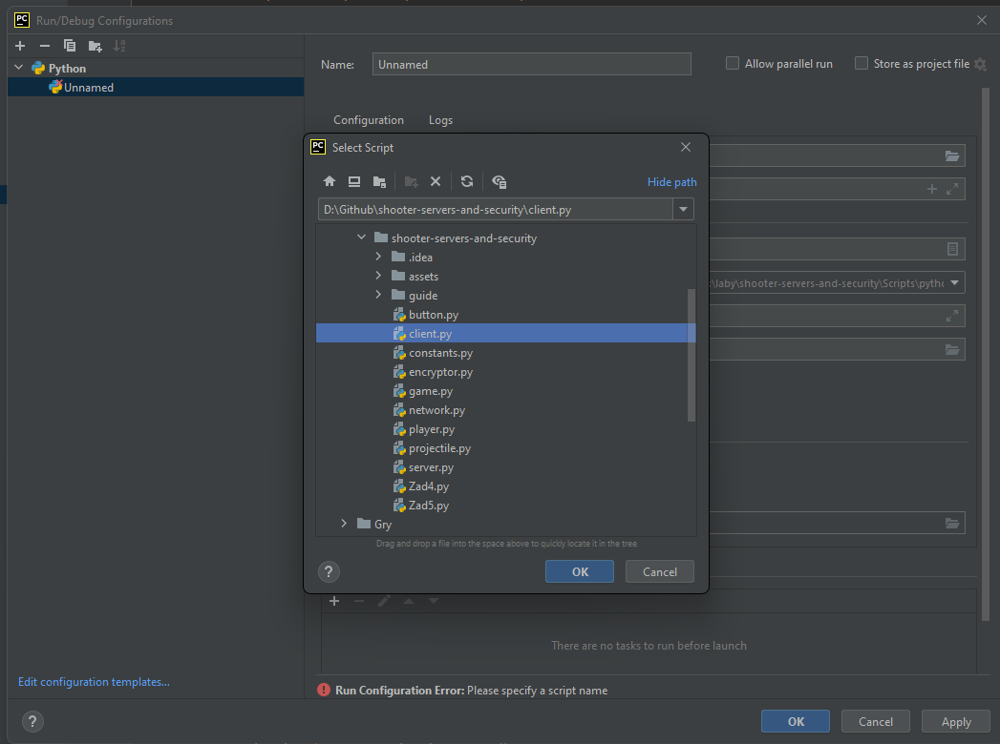
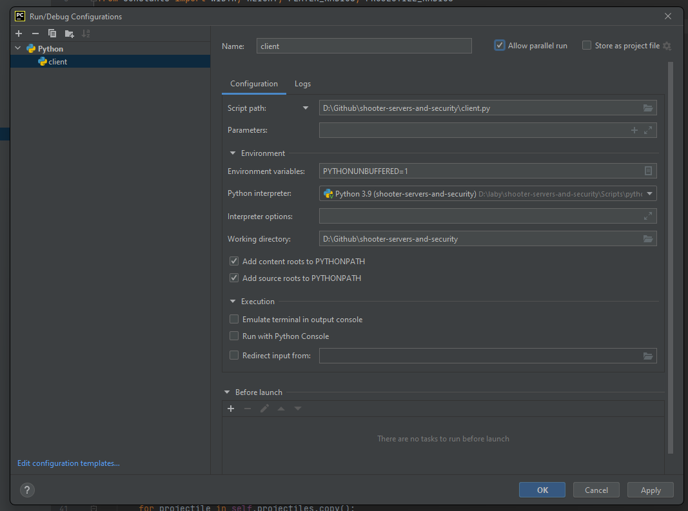

# Shooters, servers and security
[Wykorzystane grafiki](https://thomasgvd.itch.io/top-down-shooter)  
[Wykorzystane tło](https://openverse.org/image/4973b527-1670-4f61-a045-af94de18c022?q=grass)

## Na start
Po pobraniu projektu zainstaluj moduły podane w requirements.txt. Do sprawdzenia czy połączenie działa przyda się możliwość uruchomienia dwóch instancji clienta. Jeśli korzystasz ze środowiska PyCharm to możesz skorzystać z poniższego poradnika:

## Wstęp do zadań
Żeby uruchomić aplikacje najpierw uruchom serwer, a dopiero później clienta. Na początku nie wszystko będzie działać, a nawet pojawią się błędy które trzeba naprawić wykonując poniższe zadania. Powodzenia!

## Zad 1
W projekcie brakuję grafik dla graczy i pocisków. W konstruktorze klasy Client dodaj pola player_sprite i projectile_sprite do których za pomocą biblioteki pygame wczytasz odpowiednie pliki z rozszerzeniem .png. Pamiętaj o ich przeskalowaniu! Możesz skorzystać z plików w folderze assets, ale zachęcamy do kreatywności. Po wczytaniu obrazów wyszukaj w klasie Client miejsca w których wywoływana jest metoda draw na obiektach Player i Projectile i przekaż do nich utworzone pola.

## Zad 2
Nie działa przesyłanie informacji o stworzeniu nowego pocisku przez gracza, dlatego nie widać go w drugim cliencie. Żeby to naprawić napisz metodę send_projectile, która przyjmuję obiekt klasy Projectile i przesyła go do serwera. Możesz wzorować się na kodzie metody send_player która znajduję się w tej samej klasie

## Zad 3
Brakuje detekcji kolizji przez co pociski nie zadają obrażeń. W klasie client zaimplementuj metode check_circle_overlap która sprawdzi czy koła o podanych parametrach się nakładają. Przyjmuje ona 4 argumenty:
1. pos1 - tablica dwuelementowa zawierająca współrzędne X i Y pierwszego obiektu (pos1[0] = x, pos1[1] = y)
2. radius1 - średnica pierwszego obiektu
3. pos2 - tablica dwuelementowa zawierająca współrzędne X i Y drugiego obiektu
4. radius2 - średnica drugiego obiektu  

Powinna zwrócić true jeśli oba koła się nakładają i false w każdym innym przypadku

## Zad 4
Napisz funkcję szyfrującą plik tekstowy algorytmem AES w trybie ECB

## Zad 5
Napisz funkcję która wczyta i odszyfruje plik algorytmem AES w trybie ECB

## ZADANIE DODATKOWE 
Spróbuj połączyć się przez sieć lokalną z inną osobą na sali :)
